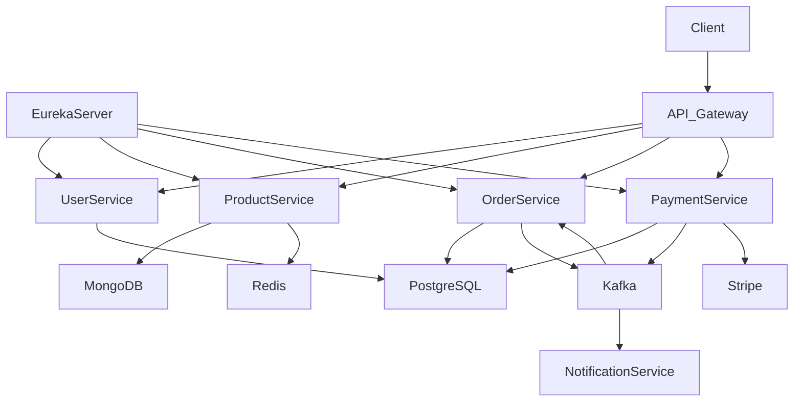

# Architecture

System is based on microservice architecture.

It consists of independent services communicating via REST and Kafka.

## Services

- User Service - manages users and security
- Product Service - manages products and inventory
- Order Service - handles orders creation and processing
- Payment Service - processes payments
- Notification Service - sends emails


## System diagram



---

### Communication

```md
## Communication

- REST API → synchronous communication
- Kafka → asynchronous events